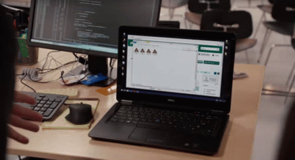

##Hard Skills

- HTML: Proficient in crafting well-structured and semantic web pages.
- CSS: Skilled in designing responsive layouts and implementing modern styles, including Flexbox and Grid.
- JavaScript: Experienced in writing clean, efficient, and maintainable code to enhance user interactions.
- React: Knowledgeable in building dynamic user interfaces with React, utilizing components, hooks, and state management.
- Node.js: Proficient in developing server-side applications with Node.js, including RESTful APIs and middleware integration.
- SQL: Experienced in database design and management, with proficiency in writing complex queries using SQL.
  
##Soft Scills

- Ability to clearly communicate ideas, both orally and in writing. 
- Able to work effectively in a group on a project, share knowledge and support colleagues.
- I am able to analyze an error, identify its root causes and find optimal solutions. 
- Able to effectively prioritize tasks and meet project deadlines. 
- Ready for changes in technologies and approaches to work, ability to quickly learn new tools or programming languages.
- I am able to understand and manage my own emotions, as well as interact effectively with colleagues and clients.
  
Latest YouTube Videos

##Languages and Tools

[]

##Follow Me

